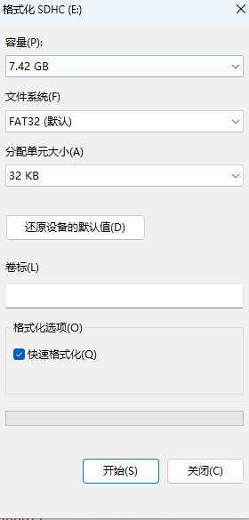
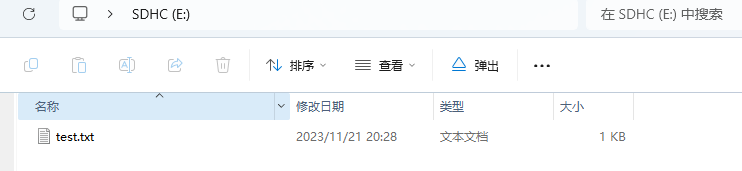

# SPI模式驱动的SD卡,配上FATFS文件系统

## 本项目所用到的硬件


一个8GB的SD卡以及SD卡槽模块	一个用于调试的小屏幕(这不是重点)	一个开发板NUCLEO-L476

### 用到的单片机外设

SPI1 用于小屏幕的显示

SPI3 用于与SD卡通信

若干GPIO引脚,操作屏幕的引脚,SD卡的片选引脚等

## CubeMX生成代码

### SPI1

**SPI1**用于屏幕的显示,因此选择**Trandmit Only Master**即可

主要参数如下图:


**NOTE:**

重点在于**Data Size**要设置为8Bits

​		**First Bit**要设为MSB First

​		**CLock Polarity**设为Low

​		**Clock Phase**设为1 Edge

使用软件片选

其他选项默认即可

以下是SPI1所用到的两个引脚

SPI1_CLK->PA5

SPI1_MOSI->PA7

### SPI3

SPI3用于和SD卡进行通信,要选择**Full-Duplex Master **模式

主要参数如下图


**NOTE:**

重点在于**Data Size**要设置为8Bits

​		**First Bit**要设为MSB First

​		**CLock Polarity**设为High

​		**Clock Phase**设为2 Edge

使用软件片选

其他选项默认即可

以下是SPI3占用的引脚

SPI3_CLK->PC10

SPI3_MISO->PC11

SPI3_MOSI->PC12

### FATFS文件系统

SD卡要和文件系统一起才好玩

对于文件系统只用勾选一个User-defined,其他参数默认即可,以后再折腾这些参数


其他诸如时钟设置,调试接口等建立工程基本的选项就不在这里说明,这不是重点

在**Project Manager**中设定好工程名称

**Code　Generarot**勾选

然后点击右上角**GENERATE CODE**,CubeMX配置就结束了

## 项目代码

### SD卡驱动

SD卡驱动文件在demo_SPI_SD_Card/Drivers/SD_Driver

SD_Driver/Inc/sd.h

SD_Driver/Src/sd.c

sd.c和sd.h文件是SD卡的应用层代码,实现诸如读取写入等功能

SD_Driver/Inc/sd_interface.h

SD_Driver/Inc/sd_interface.c

sd_interface.c和sd_interface.h是SD卡的底层代码,包括调用SPI3发送接收数据,片选引脚SD_CS的初始化代码,控制SD_CS引脚的高低电平,一个ms级延迟函数

sd_interface.c是在移植SD驱动代码时唯一需要修改的地方

**注:SD卡调用SPI3**

#### SD卡驱动具体如何移植

**在sd_interface.h中**

定义了SD卡片选引脚,你需要修改成你自己的

```c
//SD卡片选引脚选择
#define SD_CS_GPIO_Port     GPIOD
#define SD_CS_Pin           GPIO_PIN_2
#define SD_CS_GPIO_Colck    __HAL_RCC_GPIOD_CLK_ENABLE()
```


也定义了SPI的句柄,你需要修改成你自己的,SPI的初始化代码由CubeMX自动生成位于demo_SPI_SD_Card/Core/Src/spi.c中

```c
//SD卡SPI
#define HandSPI     hspi3
```


还有一点需要注意

在SD卡初始化时,为适应MMC卡要求,需要将SPI_CLK控制在400KHz以下,因此需要将SPI暂时使用较慢的初始化方式,SD初始化完成后,再使用快速的SPI

```c
uint8_t SD_Init(void) {
    //上面有很多代码

    //为适应MMC卡要求时钟 < 400KHz,暂用256分频
    SD_SPI3_Init();

    //下面有很多代码

    return temp;
}
```

其中的SD_SPI3_Init();函数我是这样写的,这个函数位于demo_SPI_SD_Card/Core/Src/spi.c中

```c
void SD_SPI3_Init(void) {
    hspi3.Instance = SPI3;
  hspi3.Init.Mode = SPI_MODE_MASTER;
  hspi3.Init.Direction = SPI_DIRECTION_2LINES;
  hspi3.Init.DataSize = SPI_DATASIZE_8BIT;
  hspi3.Init.CLKPolarity = SPI_POLARITY_LOW;
  hspi3.Init.CLKPhase = SPI_PHASE_1EDGE;
  hspi3.Init.NSS = SPI_NSS_SOFT;
  hspi3.Init.BaudRatePrescaler = SPI_BAUDRATEPRESCALER_256;	//256分频,单片机主频80MHz,这样波特率为312.5KBit/s
  hspi3.Init.FirstBit = SPI_FIRSTBIT_MSB;
  hspi3.Init.TIMode = SPI_TIMODE_DISABLE;
  hspi3.Init.CRCCalculation = SPI_CRCCALCULATION_DISABLE;
  hspi3.Init.CRCPolynomial = 7;
  hspi3.Init.CRCLength = SPI_CRC_LENGTH_DATASIZE;
  hspi3.Init.NSSPMode = SPI_NSS_PULSE_ENABLE;
  if (HAL_SPI_Init(&hspi3) != HAL_OK)
  {
    Error_Handler();
  }
}
```

**在lcd_interface.c中**

有五个函数,你需要重构

```c
/* SPI发送与接收接口函数.这里SPI使用应答式,MISO和MOSI不同时传输有效数据
 * @param txdata 要发送的八位数据
 * @retval RxData 接收到的数据*/
uint8_t sd_interface_transmit_receive_data(uint8_t txdata) {
    uint8_t RxData;
//    //先调用发送函数
//    HAL_SPI_Transmit(&HandSPI,&txdata,1,10);
//
//    //发送完成后,再调用接收函数
//    HAL_SPI_Receive(&HandSPI,&RxData,1,10);
    HAL_SPI_TransmitReceive(&HandSPI,&txdata,&RxData,1,1000);

    return RxData;
}
```


```c
/* @brief 对CS引脚GPIO进行初始化*/
void sd_interface_gpio_init(void) {
    //定义初始化结构体
    GPIO_InitTypeDef GPIO_InitStruct = {0};

    //使能GPIO时钟
    SD_CS_GPIO_Colck;

    //初始化GPIO电平
    HAL_GPIO_WritePin(SD_CS_GPIO_Port,SD_CS_Pin,GPIO_PIN_SET);

    //配置GPIO模式
    GPIO_InitStruct.Pin = SD_CS_Pin;
    GPIO_InitStruct.Mode = GPIO_MODE_OUTPUT_PP;
    GPIO_InitStruct.Pull = GPIO_NOPULL;
    GPIO_InitStruct.Speed = GPIO_SPEED_FREQ_HIGH;

    //调用HAL_GPIO_Init()函数进行初始化
    HAL_GPIO_Init(SD_CS_GPIO_Port,&GPIO_InitStruct);
}
```


```c
/* SD_CS_Pin接口函数*/
void sd_interface_cs_set(void) {
    //拉高SD_CS
    HAL_GPIO_WritePin(SD_CS_GPIO_Port,SD_CS_Pin,GPIO_PIN_SET);
}

void sd_interface_cs_clr(void) {
    //拉低SD_CS
    HAL_GPIO_WritePin(SD_CS_GPIO_Port,SD_CS_Pin,GPIO_PIN_RESET);
}
```


```c
/* @brief 提供ms级延迟*/
void sd_interface_delayms(uint32_t ms) {
    //提供ms级延迟函数
    HAL_Delay(ms);
}
```


### LCD屏幕驱动

这个屏幕驱动不是重点,这只是我用来进行调试,如果你有其他调试方法可以用你自己的

LCD屏幕驱动代码位于demo_SPI_SD_Card/Drivers/LCD_240_280

LCD_240_280/Inc/lcd.h

LCD_240_280/Inc/lcd_interface.h

LCD_240_280/Inc/lcdfont.h

LCD_240_280/Inc/pic.h

LCD_240_280/Src/lcd.c

LCD_240_280/Src/lcd_interface.c

和SD卡驱动代码的结构一样

lcd_interface.c和lcd_interface.h是屏幕的底层接口,如果需要移植,只用关注这两个文件即可

lcd.c和lcd.h是LCD屏幕应用层代码,实现显示字符图形的功能

lcdfont.h则存储着字库

pic.h则存储着用于显示的图片数组

**注:LCD屏幕调用SPI1**

## FATFS文件系统

CubeMX生成的代码有两部分

一部分是FATFS的内核代码,位于demo_SPI_SD_Card/Middlewares/Third_Party/src中,不够我们并不需要关心

demo_SPI_SD_Card/FATFS中的代码才是需要关心的

特别的:demo_SPI_SD_Card/FATFS/Target/user_diskio.c是与SD卡相接的地方,是需要注意的

user_diskio.c中有五个函数,你需要一一实现它

在实现之前,别忘记包含SD卡驱动的头文件

```c
#include "sd.h"
```

首先第一个函数,该函数会在调用f_mount()挂载SD卡时自动执行

```c
/**
  * @brief  Initializes a Drive
  * @param  pdrv: Physical drive number (0..)
  * @retval DSTATUS: Operation status
  */
DSTATUS USER_initialize (
    BYTE pdrv           /* Physical drive nmuber to identify the drive */
)
{
  /* USER CODE BEGIN INIT */
    Stat = STA_NOINIT;

    //SD Card init
    if(SD_Init() == 0) {
        Stat &= ~STA_NOINIT;
    }

    return Stat;
  /* USER CODE END INIT */
}
```


第二个函数用来获取SD卡的状态,这个工程先跑起来,这些细枝末节的东西后面再慢慢考虑,所以在这里直接取返回

```c
/**
  * @brief  Gets Disk Status
  * @param  pdrv: Physical drive number (0..)
  * @retval DSTATUS: Operation status
  */
DSTATUS USER_status (
    BYTE pdrv       /* Physical drive number to identify the drive */
)
{
  /* USER CODE BEGIN STATUS */
    Stat = STA_NOINIT;

    //return SD state
    Stat &= ~STA_NOINIT;

    return Stat;
  /* USER CODE END STATUS */
}
```


第三个函数是读函数,调用读SD卡函数

```c
/**
  * @brief  Reads Sector(s)
  * @param  pdrv: Physical drive number (0..)
  * @param  *buff: Data buffer to store read data
  * @param  sector: Sector address (LBA)
  * @param  count: Number of sectors to read (1..128)
  * @retval DRESULT: Operation result
  */
DRESULT USER_read (
    BYTE pdrv,      /* Physical drive nmuber to identify the drive */
    BYTE *buff,     /* Data buffer to store read data */
    DWORD sector,   /* Sector address in LBA */
    UINT count      /* Number of sectors to read */
)
{
  /* USER CODE BEGIN READ */
    SDCardReadData(buff,sector,count);

    return RES_OK;
  /* USER CODE END READ */
}
```


第四个是写功能,调用SD卡写功能

```c
/**
  * @brief  Writes Sector(s)
  * @param  pdrv: Physical drive number (0..)
  * @param  *buff: Data to be written
  * @param  sector: Sector address (LBA)
  * @param  count: Number of sectors to write (1..128)
  * @retval DRESULT: Operation result
  */
#if _USE_WRITE == 1	//该_USE_WRITE宏在Middlewares/Third_Party/FatFs/src/diskio.h中定义.控制是否使用写功能
DRESULT USER_write (
    BYTE pdrv,          /* Physical drive nmuber to identify the drive */
    const BYTE *buff,   /* Data to be written */
    DWORD sector,       /* Sector address in LBA */
    UINT count          /* Number of sectors to write */
)
{
  /* USER CODE BEGIN WRITE */
  /* USER CODE HERE */

    SDCardWriteData((uint8_t *)buff,sector,count);

    return RES_OK;
  /* USER CODE END WRITE */
}
#endif /* _USE_WRITE == 1 */
```


第五个函数获取SD卡的状态

```c
/**
  * @brief  I/O control operation
  * @param  pdrv: Physical drive number (0..)
  * @param  cmd: Control code
  * @param  *buff: Buffer to send/receive control data
  * @retval DRESULT: Operation result
  */
#if _USE_IOCTL == 1	//该_USE_IOCTL宏在Middlewares/Third_Party/FatFs/src/diskio.h中定义.控制是否使用获取SD卡状态的
DRESULT USER_ioctl (
    BYTE pdrv,      /* Physical drive nmuber (0..) */
    BYTE cmd,       /* Control code */
    void *buff      /* Buffer to send/receive control data */
)
{
  /* USER CODE BEGIN IOCTL */
    DRESULT res = RES_ERROR;

    switch (cmd) {
        case CTRL_SYNC:
            res = RES_OK;
            break;

        case GET_SECTOR_SIZE:
            *(DWORD *)buff = 512;
            break;

        case GET_BLOCK_SIZE:
            *(DWORD *)buff = 8;
            res = RES_OK;
            break;

        case GET_SECTOR_COUNT:
            *(DWORD *)buff = GetSDCardSectorCount();
            res = RES_OK;
            break;

        default:
            res = RES_ERROR;
            break;
    }

    return res;
  /* USER CODE END IOCTL */
}
#endif /* _USE_IOCTL == 1 */
```

至此,完成所有移植

## main.c中的逻辑代码

下面是main.c中代码,并删除一些被注释掉的代码

```c
#include "main.h"
#include "fatfs.h"
#include "spi.h"
#include "usart.h"
#include "gpio.h"
#include "lcd.h"
#include "sd.h"
#include "string.h"

void SystemClock_Config(void);

int main(void)
{
 
  HAL_Init();
  SystemClock_Config();
  MX_GPIO_Init();
  MX_SPI1_Init();
  MX_USART2_UART_Init();
  MX_SPI3_Init();
  MX_FATFS_Init();
    
    //初始化LCD屏幕
    LCD_Init(WHITE);
    
    FATFS *fs;
    FRESULT ret;
    //apply malloc
    fs = (FATFS *)malloc(sizeof(FATFS));

    //mount SD device
    ret = f_mount(fs,"0:",1);	//这里填"0:"我也不知道为啥
    if(ret) {
        LCD_ShowString(30,0,"mount fail",BLACK,WHITE,16,1);
    } else {
        LCD_ShowString(30, 0, "mount OK", BLACK, WHITE, 16, 1);
    }

    //open file
    FIL *fil;
    FRESULT res;
    fil = malloc(sizeof(FIL));
    res = f_open(fil,"test.txt",FA_READ | FA_WRITE | FA_OPEN_ALWAYS);
    if(res) {
        LCD_ShowString(30,16,"open fail",BLACK,WHITE,16,1);
    } else {
        LCD_ShowString(30,16,"open OK",BLACK,WHITE,16,1);
    }

    //read file attention: read and write ptr
    uint8_t RxBuff[512] = {0};
    uint16_t FSize;
    uint16_t ReadCount;
    FSize = f_size(fil);
    f_read(fil,RxBuff,FSize,(UINT *)&ReadCount);
    if(ReadCount != 0) {
        for(uint8_t i = 0;i < FSize;i++) {
            LCD_ShowChar(30 + 8*i,16*2,RxBuff[i],BLACK,WHITE,16,1);
        }
    }

    //write file
//    uint16_t WriteCount;
//    f_write(fil,"Hello?",sizeof("Hello?"),(UINT *)&WriteCount);

    //close file
    f_close(fil);

 
  while (1)
  {
      
  }
}

/**
  * @brief System Clock Configuration
  * @retval None
  */
void SystemClock_Config(void)
{
  RCC_OscInitTypeDef RCC_OscInitStruct = {0};
  RCC_ClkInitTypeDef RCC_ClkInitStruct = {0};

  /** Configure the main internal regulator output voltage
  */
  if (HAL_PWREx_ControlVoltageScaling(PWR_REGULATOR_VOLTAGE_SCALE1) != HAL_OK)
  {
    Error_Handler();
  }

  /** Initializes the RCC Oscillators according to the specified parameters
  * in the RCC_OscInitTypeDef structure.
  */
  RCC_OscInitStruct.OscillatorType = RCC_OSCILLATORTYPE_HSI;
  RCC_OscInitStruct.HSIState = RCC_HSI_ON;
  RCC_OscInitStruct.HSICalibrationValue = RCC_HSICALIBRATION_DEFAULT;
  RCC_OscInitStruct.PLL.PLLState = RCC_PLL_ON;
  RCC_OscInitStruct.PLL.PLLSource = RCC_PLLSOURCE_HSI;
  RCC_OscInitStruct.PLL.PLLM = 1;
  RCC_OscInitStruct.PLL.PLLN = 10;
  RCC_OscInitStruct.PLL.PLLP = RCC_PLLP_DIV7;
  RCC_OscInitStruct.PLL.PLLQ = RCC_PLLQ_DIV2;
  RCC_OscInitStruct.PLL.PLLR = RCC_PLLR_DIV2;
  if (HAL_RCC_OscConfig(&RCC_OscInitStruct) != HAL_OK)
  {
    Error_Handler();
  }

  /** Initializes the CPU, AHB and APB buses clocks
  */
  RCC_ClkInitStruct.ClockType = RCC_CLOCKTYPE_HCLK|RCC_CLOCKTYPE_SYSCLK
                              |RCC_CLOCKTYPE_PCLK1|RCC_CLOCKTYPE_PCLK2;
  RCC_ClkInitStruct.SYSCLKSource = RCC_SYSCLKSOURCE_PLLCLK;
  RCC_ClkInitStruct.AHBCLKDivider = RCC_SYSCLK_DIV1;
  RCC_ClkInitStruct.APB1CLKDivider = RCC_HCLK_DIV1;
  RCC_ClkInitStruct.APB2CLKDivider = RCC_HCLK_DIV1;

  if (HAL_RCC_ClockConfig(&RCC_ClkInitStruct, FLASH_LATENCY_4) != HAL_OK)
  {
    Error_Handler();
  }
}

/* USER CODE BEGIN 4 */

/* USER CODE END 4 */

/**
  * @brief  This function is executed in case of error occurrence.
  * @retval None
  */
void Error_Handler(void)
{
  /* USER CODE BEGIN Error_Handler_Debug */
  /* User can add his own implementation to report the HAL error return state */
  __disable_irq();
  while (1)
  {
  }
  /* USER CODE END Error_Handler_Debug */
}

#ifdef  USE_FULL_ASSERT
/**
  * @brief  Reports the name of the source file and the source line number
  *         where the assert_param error has occurred.
  * @param  file: pointer to the source file name
  * @param  line: assert_param error line source number
  * @retval None
  */
void assert_failed(uint8_t *file, uint32_t line)
{
  /* USER CODE BEGIN 6 */
  /* User can add his own implementation to report the file name and line number,
     ex: printf("Wrong parameters value: file %s on line %d\r\n", file, line) */
  /* USER CODE END 6 */
}
#endif /* USE_FULL_ASSERT */
```

## 最后的效果

将SD卡插电脑上,使用前要先格式化一下存储卡




在SD中创建一个名为test.txt文件




在该文件中写上一些东西


保存并弹出SD卡


将SD卡插SD卡读卡器模块上


下载代码并运行,如果没问题,你就会在屏幕上看到你刚刚在test.txt文件中写的东西

